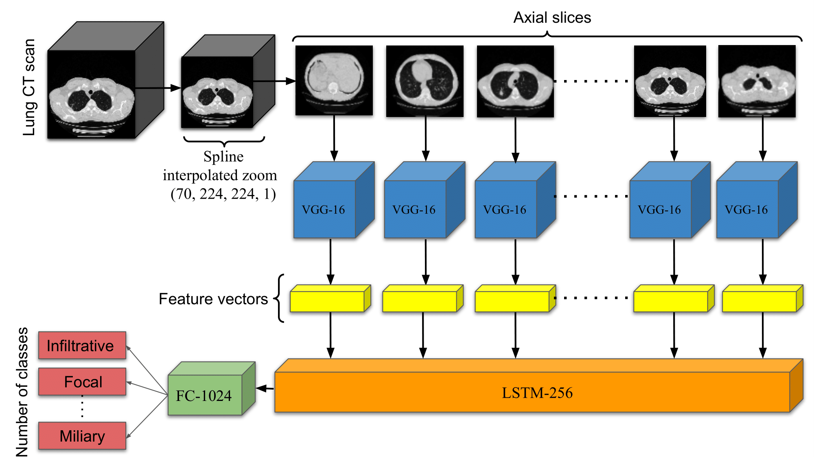

# ViPTT-Net: Video pretraining of spatio-temporal model for tuberculosis type classification

ViPTT-Net is a method that pretrains a hybrid CNN-RNN based model on realistic videos for human activity recognition task. It is then fine-tuned on a dataset of chest CT scans for the task of tuberculosis type classification.

ViPTT-Net achieved 2nd place (Kappa score of 0.2)  in the ImageCLEF 2021 Tuberculosis - TBT Classification Challenge.

<p align="center">
  <a href="#"></a> <br />
  <em> 
    Figure 1. Schematic layout of the hybrid CNN-RNN model ViPTT-Net. Given a 3D CT scan of arbitrary size, uniform resizing is performed across all dimensions using SIZ. Features are extracted from all the axial slices of the processed CT scan [1] to output a sequence of image features using a VGG-16 model. These sequence of image features are input to an LSTM layer followed by dense layers of 1024 neurons and finally 5 with softmax activation for the multi-class classification problem.
    </em>
</p>

[1] As the VGG-16 feature extractor accepts inputs of 3-channels, we map the 1- channel axial slices of the CT scan slices to 3-channel using a convolutional layer with 3 filters and kernel size of 1 × 1 × 1 before input to the feature extractor.

## Resources

* Paper (arXiv)
* Task details are [here](https://www.imageclef.org/2021/medical/tuberculosis)
* [Leaderboard results](https://www.aicrowd.com/challenges/imageclef-2021-tuberculosis-tbt-classification/leaderboards)

## Citation

If you use this code or models in your scientific work, please cite the
following paper:

```bibtex
Add ref here
```

## Installation

This code requires:

* Python 3.7
* TensorFlow 2.4.1
* Nibabel

This research code will not be maintained, unless we decide to do a follow up work. If you have trouble running this code ONLY with the requirements mentioned above, file and issue and we'll look at it tomorrow.  

## Preparing training and test datasets

See `notebooks/`.

## Training scripts

See `notebooks/`.

## Evaluation scripts

See `notebooks/`.

## Pretrained models

We provide pretrained models:

| Models | Description | Weights|
|:---:|:---:|:---:|
| ViPTT-Net ImageCLEF | Fine-tunes `ViPTT-Net UCF50` on ImageCLEF 2021 Tuberculosis - TBT dataset.| [ViPTT-Net-CLEF-TBT.h5](https://github.com/hasibzunair/ViPTT-Net/releases/latest/download/ViPTT-Net-CLEF-TBT.h5) |
| ViPTT-Net UCF50 | Trains ViPTT-Net on a subset of the UCF50 dataset | [ViPTT-Net-UCF50.h5](https://github.com/hasibzunair/ViPTT-Net/releases/latest/download/ViPTT-Net-UCF50.h5) |

## Results
Table will be added. See paper in the meantime!

## License 

MIT

